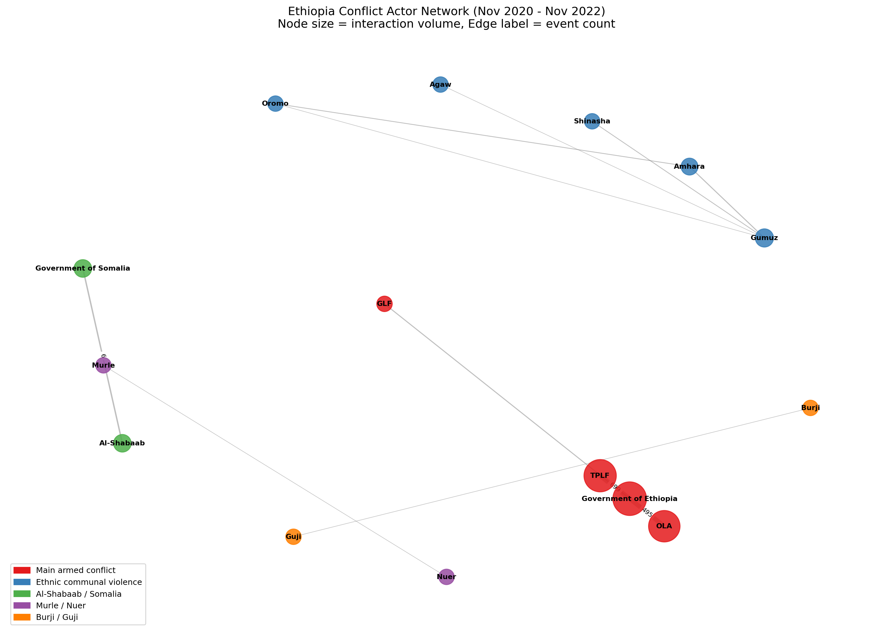
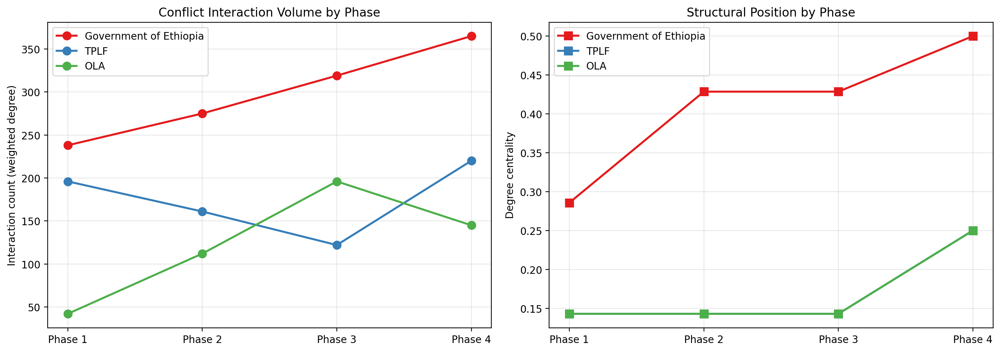
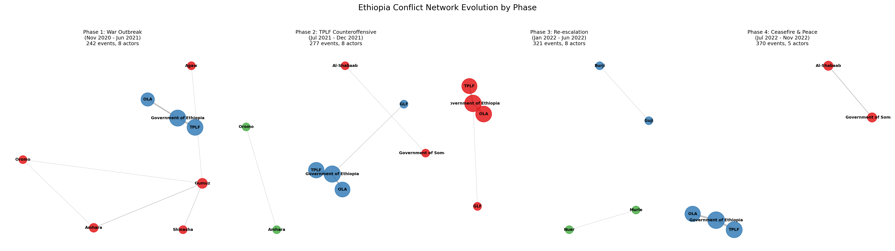
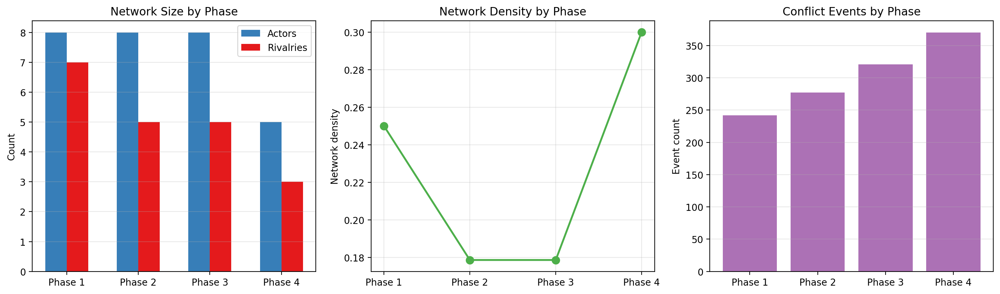
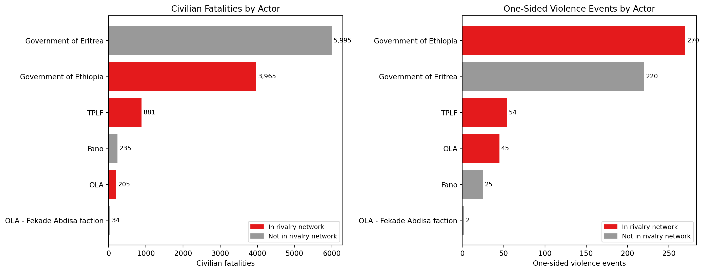
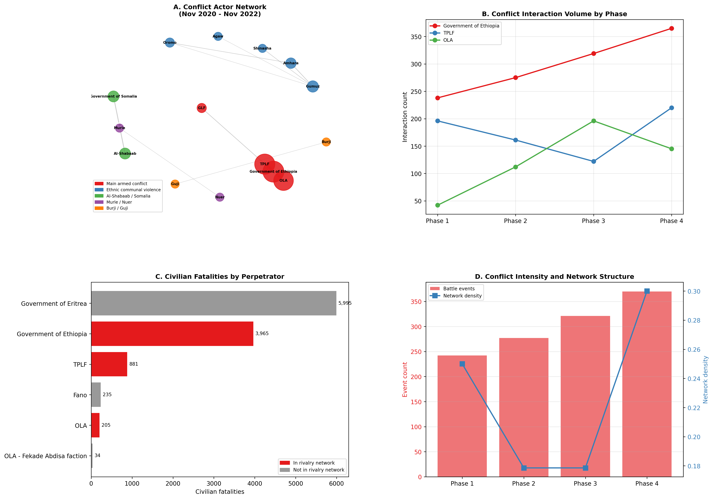

# Conflict Actor Network Analysis

Social network analysis of armed group interactions during the Ethiopia/Tigray conflict (November 2020 – November 2022), using UCDP georeferenced event data.

## Research Question

How does the structure of armed group rivalries relate to conflict intensity and violence against civilians during the Ethiopia/Tigray conflict?

## Key Findings

**1. A fragmented conflict space with one central actor.**
The conflict actor network contains 15 actors and 11 rivalry edges organized into 5 disconnected components. Government of Ethiopia is the only actor bridging multiple conflict fronts (Tigray, Oromiya, Gambella).



**2. The network consolidated over time.**
Active actors contracted from 8 in Phase 1 to 5 in Phase 4, while event volume increased from 242 to 370. Fewer actors fought more intensely as the conflict approached the November 2022 ceasefire. Government of Ethiopia's degree centrality rose from 0.286 to 0.500 across phases. TPLF and OLA followed opposite interaction arcs: OLA rose then fell, TPLF dipped then surged in the final phase.





**3. Conflict intensity increased as the network shrank.**
Network density dropped from 0.250 to 0.179 in the middle phases before jumping to 0.300 in Phase 4. Battle events rose steadily across all four phases.



**4. The deadliest actor against civilians is invisible in the rivalry network.**
Government of Eritrea committed the most civilian fatalities (5,995) but does not appear as an independent combatant in UCDP rivalry data. All its recorded events are civilian targeting or coalition entries with Government of Ethiopia. This highlights a structural limitation in using UCDP for network construction.



**5. Publication summary figure.**



## Data

| Dataset | Version | Source |
|---------|---------|--------|
| UCDP Georeferenced Event Dataset (GED) | v25.1 | [ucdp.uu.se](https://ucdp.uu.se/downloads/) |
| UCDP Dyadic Dataset | v25.1 | [ucdp.uu.se](https://ucdp.uu.se/downloads/) |

Filtered to Ethiopia, November 2020 to November 2022 (1,764 events total, 1,210 battle events, 554 one-sided violence events).

## Methods

| Method | Tool | Purpose |
|--------|------|---------|
| Graph construction | NetworkX | Build weighted undirected networks from actor co-occurrence in conflict events |
| Centrality analysis | NetworkX | Degree, betweenness, eigenvector, closeness centrality |
| Community detection | python-louvain | Louvain algorithm to identify actor clusters |
| Temporal snapshots | NetworkX | Phase-specific networks across four conflict periods |
| Violence outcome analysis | pandas, scipy | Descriptive comparison of network position and civilian targeting |
| Interactive visualization | pyvis | HTML network graphs with hover details |

## Notebooks

| Notebook | Description |
|----------|-------------|
| `01_network_construction.ipynb` | Builds the aggregate conflict network, computes centrality measures, runs community detection, produces static and interactive visualizations |
| `02_temporal_networks.ipynb` | Splits the conflict into four phases, builds phase-specific networks, tracks actor centrality trajectories and network-level metrics over time |
| `03_network_outcomes.ipynb` | Merges network metrics with one-sided violence data, compares civilian targeting across actors with and without rivalry network positions, produces publication-quality figures |

Each notebook has a companion `_GUIDE.md` file explaining the concepts and methods used.

## Conflict Phases

| Phase | Period | Battle Events | Active Actors |
|-------|--------|---------------|---------------|
| 1. War Outbreak | Nov 2020 – Jun 2021 | 242 | 8 |
| 2. TPLF Counteroffensive | Jul 2021 – Dec 2021 | 277 | 8 |
| 3. Re-escalation | Jan 2022 – Jun 2022 | 321 | 8 |
| 4. Ceasefire and Peace | Jul 2022 – Nov 2022 | 370 | 5 |

## Project Structure

```
conflict-network-analysis/
├── data/
│   ├── GEDEvent_v25_1.csv
│   └── Dyadic_v25_1.csv
├── notebooks/
│   ├── 01_network_construction.ipynb
│   ├── 01_network_construction_GUIDE.md
│   ├── 02_temporal_networks.ipynb
│   ├── 02_temporal_networks_GUIDE.md
│   ├── 03_network_outcomes.ipynb
│   └── 03_network_outcomes_GUIDE.md
├── outputs/
│   ├── 01_static_network.png
│   ├── 01_interactive_network.html
│   ├── 02_actor_trajectories.png
│   ├── 02_phase_networks.png
│   ├── 02_network_metrics.png
│   ├── 03_civilian_violence_by_actor.png
│   └── 03_publication_figure.png
├── .gitignore
└── README.md
```

## Tools

Python 3.11, pandas, NetworkX, python-louvain, pyvis, matplotlib, seaborn, scipy

## References

- Deutschmann, E., Lorenz, J., and Nardin, L.G. (eds.) (2020). *Computational Conflict Research*. Springer.
- Kramer, C.R. (2017). *Network Theory and Violent Conflicts*. Palgrave Macmillan.
- Metternich, N. et al. (2013). Antigovernment Networks in Civil Conflicts. *American Journal of Political Science*.
- Perliger, A. and Pedahzur, A. (2011). Social Network Analysis in the Study of Terrorism and Political Violence. *PS: Political Science and Politics*.
- Lilja, J. (2012). Rebel Group Network Structure and Peace Negotiations. *International Interactions*.

## Portfolio Context

This is Project 3 in a six-project computational social science portfolio for conflict research.

| Project | Topic | Status |
|---------|-------|--------|
| 1 | [Conflict Event Data Analysis and Geospatial Visualization](https://github.com/Sezibra/conflict-event-analysis) | Complete |
| 2 | [LLM-Powered Conflict Text Analysis](https://github.com/Sezibra/conflict-text-analysis) | Complete |
| 3 | **Conflict Actor Network Analysis** (this repo) | **Complete** |
| 4 | Conflict Forecasting with Machine Learning | Upcoming |
| 5 | Causal Inference for Conflict with ML | Upcoming |
| 6 | Satellite Imagery for Conflict Damage Assessment (optional) | Upcoming |